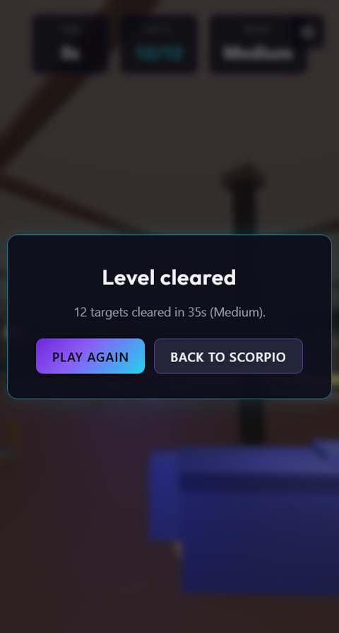
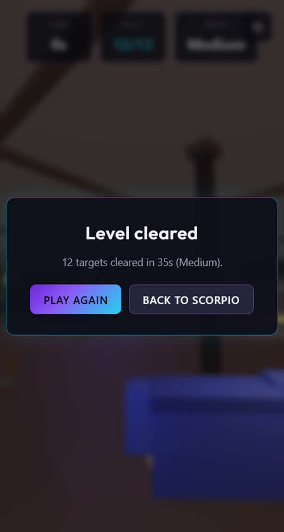

# Project Scorpio: Aim Lab

Standalone browser **FPS aim trainer** from the [Project Scorpio](https://github.com/faridali2003/project_scorpio) series.

**Slug:** `project_scorpio__aim_lab`

## Screenshots

| Difficulty menu | Gameplay HUD | Level cleared |
|-----------------|--------------|---------------|
|  |  |  |

## Features

- Cafe arena with balloon targets
- CS-style movement, jump, crouch
- Difficulty modes + **Free Practice** (no timer)
- Blocky viewmodel arms and rifle
- Built with **React + Three.js**

## Run locally

```bash
npm install
npm start
```

Open **http://localhost:3000** on your machine.

## Controls

- **WASD** — move
- **Mouse** — look (click to lock pointer)
- **Space** — jump
- **Ctrl / C** — crouch
- **LMB** — shoot
- **Tab** — settings

## Tech highlights

- GLB cafe map collision + procedural enemy spawns
- Pointer-lock FPS controls with step-up movement
- Difficulty presets in `src/game/difficulties.js`
- Minecraft-style procedural viewmodel (no broken GLTF arms)

## Part of Project Scorpio

| Repo | Role |
|------|------|
| [project_scorpio](https://github.com/faridali2003/project_scorpio) | Full storefront platform |
| **project_scorpio-aim-lab** (this repo) | Standalone aim trainer game |

## Security

- No backend required — browser-only
- No secrets or `.env` needed
- Do not commit personal files or API keys

## Author

**faridali2003** — portfolio / game dev demo. Not affiliated with Valve or Steam.
